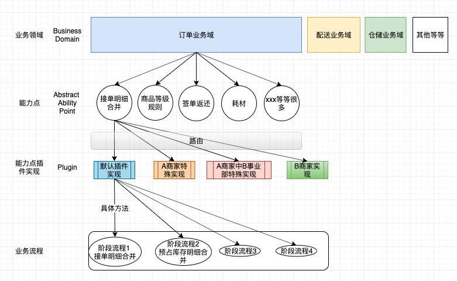

# 能力扩展点

## 介绍

将散落着,隐藏在各种系统间,不同TOB商家的各种业务逻辑, 归纳整合.让业务能力现身,统一管理.




### 业务能力拓展点描述

- 业务领域(BusinessDomain)

  将各种业务按领域划分,订单领域,配送领域等.

- 业务能力扩展点(能力点/扩展点)(Ability Point)

  实现一种业务能力,比如订单明细合并.

- 插件(Plugin)

  能力点的一个实现，一个能力点可能对应多个插件,有多种实现,多态地满足不同的业务场景需求.由插件微内核根据业务身份进行路由和加载.

  比如xxxxx业务逻辑,有A商家要求的实现,也有B商家要求的实现.

- 业务身份(BusinessIdentity)

   除了默认插件外的,能力点的其他插件实现,都是带有业务身份的,属于哪个商家,哪个事业部.

  可以通过业务身份的识别路由来决定调用哪个插件实现
  
- 具体功能点
  
  业务能力点的一部分,在代码维度可能是能力点/插件中的一个方法,实现某个细化具体功能.
  
- 阶段(Phase)

  一个能力点可能在整个流程中的多个步骤用到,有一定差别.体现为能力点接口中的不同阶段方法.

  对宿主系统的依赖(服务依赖)也是分阶段管理的.

  

**补充:**

- 能力点是被嵌入宿主系统(具体业务系统)的.它本身是跨系统的,同样的能力点,可能在不同的系统,不同的阶段被使用.
- 能力点有默认的基础能力实现,每个业务方的特性业务实现可以隔离.
- 能力点不会因为宿主系统的不同而产生不同的结果
- 外部系统通过能力点对外暴露的接口、指令进行调用，能力点对外暴露的接口、指令是由业务抽取开发人员提出的，由业务能力开发人员实现.


## 对宿主系统的依赖

在能力点的实现中,在一些执行阶段可能需要宿主系统原有的一些“能力”,比如“商品查询服务”等.

在能力点内部只引入这些服务的接口,通过注解注册的方式使宿主系统知道能力点有这样的需求,在宿主系统启动时,将这些依赖的能力注入能力点.

> 当然,这些依赖的声明都是分阶段的,可以声明全阶段的依赖,也可以声明只在某些阶段依赖.


## 路由匹配

### 默认实现

每个能力点有且只有一个默认实现插件(@RegisterPlugin注解不配置businessUnitNoKeys和sellerNoKeys)

> sellerNo代表商家编号
>
> businessUnitNo代表事业部编号。  one seller multi businessUnit
>
> 同一个商家可能有多个事业部,比如A商家可能底下设置A1,A2A3,三个事业部.有商家级别的实现插件,也允许一个商家下不同事业部有不同的实现.

### @RegisterPlugin配置

@RegisterPlugin注解支持businessUnitNoKeys和sellerNoKeys两个条件进行一级路由，如果扩展点中有需要根据其他条件有不同实现的情况，扩展点自行实现二级路由
通过业务身份标识BusinessIdentity进行路由查找时优先匹配businessUnitNoKeys，如果匹配不上则使用sellerNo匹配(只匹配未指定businessUnitNoKeys的实现)，如果还没匹配到则使用默认实现.

扩展点的多个实现配置的businessUnitNoKeys和sellerNoKeys不能互相冲突，比如同一个事业部编号在两个实现都配置了.
sellerNoKeys和businessUnitNoKeys对应的key必须以`businessIdentity.`开头，定义在配置文件properties里，支持一个key对应多个值


## 对后续业务变化的适应

随着业务变化

多个业务能力可能会合并成一个
一个业务能力可能会拆分成多个更细粒度的业务能力
一个业务能力也可能演化成独立的应用系统，有自己的页面、MQ、甚至自己的复杂流程

可能产生复合能力点，将多个业务能力组织协调工作


## 宿主系统使用示范

```java
//业务身份
BusinessIdentity identity = BusinessIdentity.build().withSellerNo("SELLER_NO_0000000000001");
//插件微内核通过业务身份标识加载扩展点(接口)
SkuMergeAbilityPoint plugin = pluginContext.load(SkuMergeAbilityPoint.class,identity);
       
//命令
SkuMergeKeyCmd cmd = new SkuMergeKeyCmd();
cmd.setBusinessUnitNo("BUSINESS_UNIT_123456789");
cmd.setGoodsNo("goodsNo");
cmd.setGoodsLevel("goodsLevel");
cmd.setOrderLine("orderLine");

//给能力点下发指令，能力点执行
plugin.generateSkuMergeKeyReceiveSaleOrder(cmd);

//得到能力点的返回值
System.out.println(cmd.getReply());

```


## 代码结构

```
├── ability-core   核心包
│   ├── ability-core.iml
│   ├── pom.xml
│   └── src
│       ├── main
│       │   ├── java
│       │   │   └── com
│       │   │       └── arch
│       │   │           └── ability
│       │   │               ├── annotation  相关注解
│       │   │               │   ├── BusinessDomainEnum.java
│       │   │               │   ├── BusinessDomain.java
│       │   │               │   ├── package-info.java
│       │   │               │   ├── PhaseEnum.java
│       │   │               │   ├── Phase.java
│       │   │               │   ├── RegisterPlugin.java
│       │   │               │   └── Require.java
│       │   │               ├── cmd       命令
│       │   │               │   ├── BaseCmd.java
│       │   │               │   ├── BaseReply.java
│       │   │               │   └── package-info.java
│       │   │               ├── exception  异常
│       │   │               ├── identity     业务身份
│       │   │               │   ├── BusinessIdentity.java
│       │   │               │   └── Identifier.java
│       │   │               ├── PluginContext.java  插件上下文
│       │   │               ├── PluginContextWrapper.java
│       │   │               ├── Plugin.java
│       │   │               ├── Registry.java    注册中心
│       │   │               ├── RequirementManager.java  依赖管理
│       │   │               ├── router   路由相关
│       │   │               └── utils
│       │   │                   └── AopTargetUtils.java
│       │   └── resources
│       │       └── application.properties
│       └── test
├── ability-dependency-manage      依赖管理工程
├── plugin-architype     示范模板工程，以订单明细合并为例子
├── pom.xml
├── README.md
```


## Todolist

- [ ] 接入配置中心,可以动态更新配置

- [ ] 拦截器体系

- [ ] 完善测试用例

  


